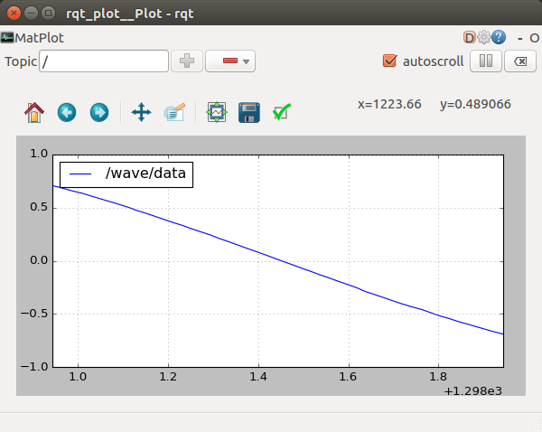

# arduino-ros-examples
Set of examples of to learn the interface between ROS and Arduino

## Dependecies
To run the examples you need both the [Arduino](https://www.arduino.cc) and [ROS Kinetic](http://wiki.ros.org/kinetic/Installation/Ubuntu), as well as two extra packages not shipped with the ROS Desktop-full installation:
```shell 
$ sudo apt-get install ros-kinetic-rosserial-arduino
$ sudo apt-get install ros-kinetic-rosserial-python
```
*Note: Examples also run correctly with ROS Indigo*

## Setting Up
The first time you need to call a python script that will generate the necessary code for the Arduino. 
```shell 
$ cd your-arduino-sketchbook/libraries
$ rosrun rosserial_arduino make_libraries.py .
```

*Note: In case you later generate (and install!) a new custom ROS message, or you install a new package with new messages, you will need to run again this script.*

## Running
1. Complie and Load The Arduino code to your board with the Arduino IDE
2. Execute the launch file: 
```shell 
$ roslaunch arduino_ros_examples oscillator.launch
```
Desprès de molts intents he aconseguit fer-lo funcionar.
pasos seguits:
  1_ copiar carpeta dins del katkin workspace.
  
  2_Des de la carpeta build hem executat el següent fitxer:
	$ roslaunch arduino_ros_examples oscillator.launch
  
  3_Aquest codi ha possat en marxa rqt on ens mostra el plot del sinus.
  Ens ha mostrat la variable, però en cas contrari dins de la casella topic s'ha d'escriure 
	$ /wave/data
	
  4_Imatge del plot a un mostreig de 20
  
  
  
  5_ imatge del plot a mostreig 5
  
 
